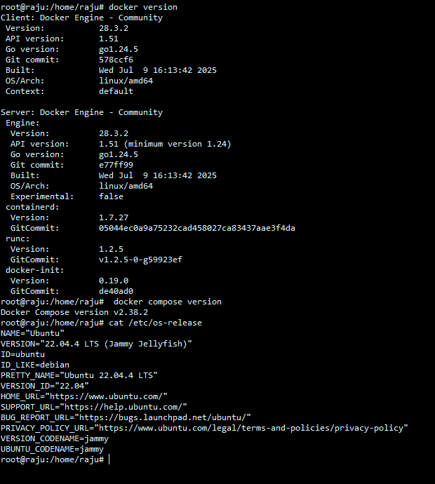
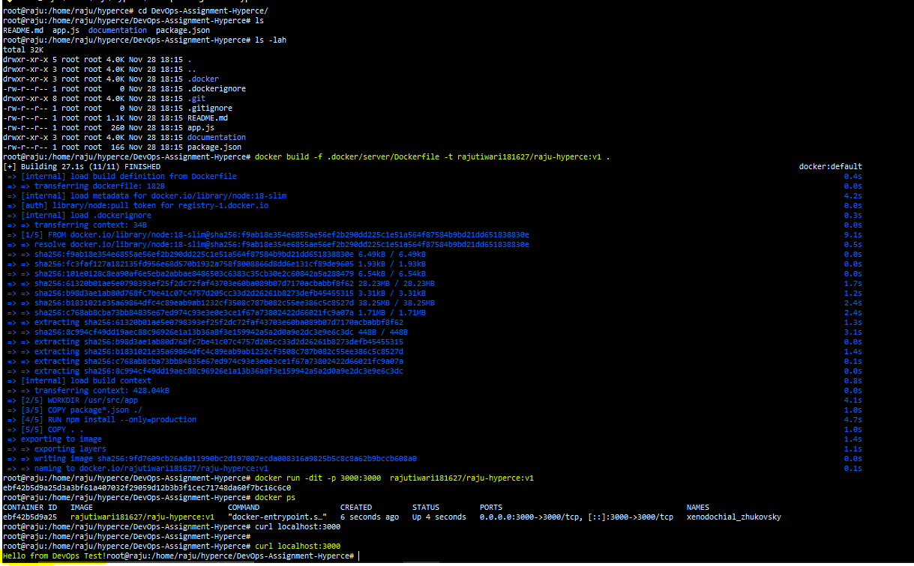

# DevOps-Assignment-Hyperce

## task 1 : Sample Application (Node.js)


- create 2 file app.js and package.json for sample express app with provided code.

## task 2 : Containerization (Docker)

### prerequisite 
- docker
- docker compose 
- follow the steps from [official site](https://docs.docker.com/engine/install/ubuntu/) for  installation


### currently used os, docker and docker compose versions

### 2.1 Create a Dockerfile that builds and runs the Node.js app.


- Docker file is created in path ``` .docker/server/Dockerfile ```

- Here, node:18 is used for version compactibility and slim for lightweight and less vulnerable

#
```bash 
#command to build image 
docker build -f .docker/server/Dockerfile -t rajutiwari181627/raju-hyperce:v1 .

#command run 
docker run -dit -p 3000:3000  rajutiwari181627/raju-hyperce:v1

```

- use customize image tagging according to your artifact/container registry

- use tag for better versioning , tracking and isolation

- ### o/p




### 2.2 Add a docker-compose.yml file for local development